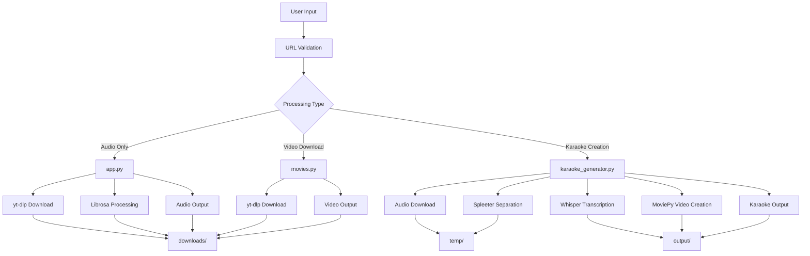

# 📁 Project Structure

Complete overview of the YouTube DL Audio & Video Processing Suite project structure, file organization, and architecture.

## 📋 Table of Contents

- [Directory Structure](#directory-structure)
- [Core Files](#core-files)
- [Documentation Files](#documentation-files)
- [Configuration Files](#configuration-files)
- [Output Directories](#output-directories)
- [Development Files](#development-files)
- [Architecture Overview](#architecture-overview)
- [File Dependencies](#file-dependencies)
- [Data Flow](#data-flow)

## 🗂️ Directory Structure

```
Youtube DL/
├── 📁 Core Application Files
│   ├── app.py                      # Audio processing module
│   ├── karaoke_generator.py        # Karaoke generation module
│   ├── movies.py                   # Video download module
│   └── requirements.txt            # Python dependencies
│
├── 📁 Documentation
│   ├── README.md                   # Main project documentation
│   ├── INSTALLATION.md             # Installation guide
│   ├── API_REFERENCE.md            # Complete API documentation
│   ├── CONTRIBUTING.md             # Contribution guidelines
│   ├── EXAMPLES.md                 # Usage examples and use cases
│   ├── CHANGELOG.md                # Version history and changes
│   ├── FIXES_APPLIED.md            # Bug fixes documentation
│   ├── PROJECT_STRUCTURE.md        # This file
│   └── LICENSE                     # MIT license
│
├── 📁 Configuration & Environment
│   ├── .env                        # Environment variables (optional)
│   ├── config.yaml                 # Application configuration (future)
│   └── .gitignore                  # Git ignore rules
│
├── 📁 Virtual Environments
│   ├── .venv/                      # Main Python virtual environment
│   └── spleeter_env/               # Spleeter-specific environment
│       ├── bin/                    # Spleeter executables
│       ├── lib/                    # Spleeter libraries
│       └── pyvenv.cfg              # Environment configuration
│
├── 📁 Output Directories
│   ├── downloads/                  # Downloaded audio/video files
│   │   ├── *.mp3                   # Audio files
│   │   ├── *.mp4                   # Video files
│   │   ├── voice.wav               # Separated vocals
│   │   └── background.wav          # Separated instrumentals
│   │
│   ├── temp/                       # Temporary processing files
│   │   ├── audio_files/            # Temporary audio storage
│   │   ├── {song_name}/            # Spleeter output folders
│   │   │   ├── vocals.wav          # Vocal track
│   │   │   └── accompaniment.wav   # Instrumental track
│   │   └── *.tmp                   # Temporary files
│   │
│   └── output/                     # Final karaoke videos
│       ├── *_karaoke.mp4          # Generated karaoke videos
│       └── metadata/               # Video metadata (future)
│
├── 📁 AI Models & Data
│   ├── pretrained_models/          # Whisper model cache
│   │   ├── base.pt                 # Whisper base model
│   │   ├── large.pt                # Whisper large model (if downloaded)
│   │   └── model_info.json         # Model metadata
│   │
│   └── spleeter_models/            # Spleeter model cache (auto-managed)
│       ├── 2stems/                 # 2-stem separation model
│       ├── 4stems/                 # 4-stem separation model
│       └── 5stems/                 # 5-stem separation model
│
├── 📁 Logs & Monitoring
│   ├── logs/                       # Application logs
│   │   ├── app.log                 # Main application log
│   │   ├── error.log               # Error logs
│   │   ├── processing.log          # Processing activity log
│   │   └── monitor.log             # System monitoring log
│   │
│   └── monitoring/                 # Monitoring reports
│       ├── monitor_report.txt      # Latest monitoring report
│       └── performance_stats.json  # Performance metrics
│
├── 📁 Development & Testing
│   ├── tests/                      # Test suite
│   │   ├── unit/                   # Unit tests
│   │   │   ├── test_app.py
│   │   │   ├── test_karaoke_generator.py
│   │   │   └── test_movies.py
│   │   ├── integration/            # Integration tests
│   │   │   ├── test_full_pipeline.py
│   │   │   └── test_batch_processing.py
│   │   ├── fixtures/               # Test data
│   │   │   ├── sample_audio.mp3
│   │   │   └── sample_video.mp4
│   │   └── conftest.py            # Pytest configuration
│   │
│   ├── scripts/                    # Utility scripts
│   │   ├── setup_env.sh            # Environment setup
│   │   ├── batch_process.py        # Batch processing utility
│   │   ├── monitor_processing.py   # System monitoring
│   │   └── cleanup_temp.py         # Cleanup utility
│   │
│   └── requirements-dev.txt        # Development dependencies
│
├── 📁 Cache & Temporary
│   ├── __pycache__/               # Python bytecode cache
│   ├── .pytest_cache/             # Pytest cache
│   └── .mypy_cache/               # MyPy type checker cache
│
└── 📁 System Files
    ├── .DS_Store                   # macOS system file
    └── Thumbs.db                   # Windows system file (if present)
```

## 🔧 Core Files

### Application Modules

#### `app.py` - Audio Processing Module
```python
# Purpose: YouTube video to audio conversion and voice separation
# Dependencies: yt-dlp, librosa, soundfile
# Input: YouTube URL
# Output: MP3 audio file, separated vocals and instrumentals
# Key Functions:
#   - convert_to_audio(url) -> str
#   - separate_voice(audio_file) -> None
#   - download_audio(audio_file) -> bytes
```

#### `karaoke_generator.py` - Karaoke Video Generator
```python
# Purpose: Complete karaoke video generation pipeline
# Dependencies: yt-dlp, spleeter, stable-whisper, moviepy
# Input: YouTube URL (command line argument)
# Output: HD karaoke video with synchronized lyrics
# Key Functions:
#   - download_audio(youtube_url, output_path) -> tuple
#   - separate_vocals(audio_path, output_path) -> tuple
#   - generate_timed_lyrics(vocals_path) -> list
#   - create_karaoke_video(instrumental_path, timed_lyrics, song_title, output_path) -> None
#   - main() -> None
```

#### `movies.py` - Video Downloader
```python
# Purpose: High-quality video downloading from multiple platforms
# Dependencies: yt-dlp
# Input: Video URL (multiple platforms supported)
# Output: Video file in best available quality
# Key Functions:
#   - download_movie(url) -> str
```

### Configuration Files

#### `requirements.txt` - Python Dependencies
```
yt-dlp>=2023.1.6          # Video/audio downloading
spleeter>=2.3.0           # Audio source separation
moviepy>=1.0.3            # Video editing and creation
stable-whisper>=2.0.0     # AI speech recognition
librosa>=0.10.0           # Audio analysis and processing
soundfile>=0.12.0         # Audio file I/O
```

#### `.env` - Environment Configuration (Optional)
```bash
# Paths
DOWNLOAD_PATH=./downloads
TEMP_PATH=./temp
OUTPUT_PATH=./output

# Processing settings
MAX_WORKERS=4
WHISPER_MODEL=base
AUDIO_QUALITY=192

# Logging
LOG_LEVEL=INFO
LOG_FILE=./logs/app.log

# API settings (for web interface)
API_PORT=5000
API_HOST=0.0.0.0
```

## 📚 Documentation Files

### User Documentation

| File | Purpose | Target Audience |
|------|---------|-----------------|
| `README.md` | Main project overview and quick start | All users |
| `INSTALLATION.md` | Detailed installation instructions | New users |
| `EXAMPLES.md` | Practical usage examples | Intermediate users |
| `API_REFERENCE.md` | Complete API documentation | Developers |

### Developer Documentation

| File | Purpose | Target Audience |
|------|---------|-----------------|
| `CONTRIBUTING.md` | Development guidelines and workflow | Contributors |
| `PROJECT_STRUCTURE.md` | Architecture and file organization | Developers |
| `CHANGELOG.md` | Version history and changes | All stakeholders |
| `FIXES_APPLIED.md` | Bug fixes and improvements | Maintainers |

### Legal Documentation

| File | Purpose | Content |
|------|---------|---------|
| `LICENSE` | Project license | MIT License with third-party attributions |

## 🗃️ Output Directories

### `downloads/` - Downloaded Content
```
downloads/
├── {video_title}.mp3           # Original audio (192kbps MP3)
├── {video_title}.mp4           # Original video (best quality)
├── voice.wav                   # Separated vocals (from app.py)
├── background.wav              # Separated instrumentals (from app.py)
└── production_*.wav            # Production stems (if created)
```

**File Naming Convention:**
- Sanitized titles (alphanumeric + spaces/dashes)
- Special characters replaced with underscores
- Maximum 255 character filename length
- UTF-8 encoding support

### `temp/` - Temporary Processing Files
```
temp/
├── {sanitized_song_title}.mp3  # Downloaded audio
├── {song_title}/               # Spleeter output directory
│   ├── vocals.wav              # Isolated vocals
│   └── accompaniment.wav       # Instrumental track
├── lyrics_cache/               # Cached lyrics data
│   └── {video_id}.json         # Transcription cache
└── processing_*.tmp            # Temporary processing files
```

**Cleanup Policy:**
- Temporary files auto-removed after successful processing
- Failed processing files retained for debugging
- Manual cleanup available via `scripts/cleanup_temp.py`

### `output/` - Final Products
```
output/
├── {song_title}_karaoke.mp4    # HD karaoke video (1280x720)
├── {song_title}_custom.mp4     # Custom styled karaoke (if created)
├── metadata/                   # Video metadata
│   ├── {song_title}.json       # Processing metadata
│   └── lyrics/                 # Lyrics data
│       └── {song_title}.srt     # SubRip subtitle format
└── thumbnails/                 # Video thumbnails (future)
    └── {song_title}.jpg        # Video preview image
```

## 🛠️ Development Files

### Testing Structure
```
tests/
├── unit/                       # Unit tests (fast, isolated)
│   ├── test_app.py            # Audio processing tests
│   ├── test_karaoke_generator.py  # Karaoke generation tests
│   ├── test_movies.py         # Video download tests
│   └── test_utils.py          # Utility function tests
│
├── integration/               # Integration tests (slower, end-to-end)
│   ├── test_full_pipeline.py  # Complete workflow tests
│   ├── test_batch_processing.py  # Batch operation tests
│   └── test_error_handling.py # Error condition tests
│
├── fixtures/                  # Test data and resources
│   ├── sample_audio.mp3       # Short audio sample
│   ├── sample_video.mp4       # Short video sample
│   ├── test_urls.txt          # Test video URLs
│   └── expected_outputs/      # Expected test results
│
└── conftest.py               # Shared test configuration
```

### Utility Scripts
```
scripts/
├── setup_env.sh              # Environment setup automation
├── batch_process.py           # Batch processing utility
├── monitor_processing.py      # System monitoring and alerting
├── cleanup_temp.py            # Temporary file cleanup
├── backup_outputs.py          # Output file backup utility
└── performance_test.py        # Performance benchmarking
```

## 🏗️ Architecture Overview

### Module Relationships


### Data Flow Pipeline

#### Audio Processing Pipeline (`app.py`)
```
YouTube URL → yt-dlp → MP3 Audio → Librosa → Voice Separation → WAV Files
     ↓            ↓         ↓           ↓            ↓             ↓
   Validate → Download → Convert → Load Array → HPSS Split → Save Files
```

#### Karaoke Generation Pipeline (`karaoke_generator.py`)
```
YouTube URL → Audio Download → Vocal Separation → Lyrics Generation → Video Creation
     ↓              ↓               ↓                ↓                 ↓
   Validate → yt-dlp Extract → Spleeter AI → Whisper AI → MoviePy Render
     ↓              ↓               ↓                ↓                 ↓
  temp/audio → temp/{song}/ → temp/lyrics.json → output/karaoke.mp4
```

#### Video Download Pipeline (`movies.py`)
```
Video URL → Platform Detection → Quality Selection → Download → File Organization
    ↓             ↓                    ↓              ↓            ↓
  Validate → Parse Domain → Choose Format → yt-dlp → downloads/
```

## 📊 File Dependencies

### Python Module Dependencies
```python
# Core dependencies (required for all modules)
import os              # File system operations
import sys             # System interface
import subprocess      # External command execution

# app.py specific
import yt_dlp          # Video/audio downloading
import librosa         # Audio processing
import soundfile as sf # Audio file I/O

# karaoke_generator.py specific
import stable_whisper  # AI speech recognition
from moviepy.editor import *  # Video editing
# (also uses yt_dlp for downloading)

# movies.py specific
# (only uses yt_dlp and os)

# Development dependencies
import pytest          # Testing framework
import black           # Code formatting
import flake8          # Code linting
import mypy            # Type checking
```

### System Dependencies
```bash
# Required system packages
ffmpeg          # Multimedia processing (required by moviepy and yt-dlp)
python3         # Python runtime (3.7+)
git             # Version control (for development)

# Optional system packages  
cuda-toolkit    # GPU acceleration (for faster Whisper/Spleeter)
parallel        # GNU parallel (for batch processing scripts)
bc              # Calculator (for shell scripts)
```

### Virtual Environment Structure
```
.venv/                          # Main Python environment
├── bin/                        # Executables
│   ├── python3 → python       # Python interpreter
│   ├── pip                     # Package manager  
│   └── activate                # Environment activation
├── lib/python3.x/              # Python libraries
│   └── site-packages/          # Installed packages
└── pyvenv.cfg                  # Environment configuration

spleeter_env/                   # Spleeter-specific environment
├── bin/
│   ├── spleeter                # Spleeter executable
│   └── python3                 # Isolated Python
├── lib/python3.x/
│   └── site-packages/          # TensorFlow + Spleeter
└── pyvenv.cfg
```

## 🔄 Data Flow

### File Lifecycle

#### Temporary Files
```
Creation → Processing → Validation → Cleanup/Archive
    ↓          ↓           ↓            ↓
  temp/    Processing   Success?    Delete/Keep
             ↓           ↓            ↓
        In Progress   Archive    Error Debug
```

#### Output Files
```
Generation → Validation → Storage → User Access
     ↓           ↓          ↓          ↓
  Create     Check Size  Save to   downloads/
   File      & Format    output/   or output/
```

### Processing States
```python
# Job states tracked by the system
STATES = {
    'queued': 'Job created, waiting for processing',
    'downloading': 'Downloading audio/video from source',
    'processing': 'AI processing (separation, transcription, etc.)',
    'rendering': 'Creating final video/audio output',
    'completed': 'Successfully finished',
    'failed': 'Processing failed',
    'cancelled': 'User cancelled job'
}
```

### Error Handling Flow
```
Error Detected → Classify Error → Log Details → User Notification → Cleanup
      ↓              ↓               ↓            ↓               ↓
  Exception     Network/AI/       Write to    Show Message   Remove Temp
   Caught       File Error       error.log                    Files
```

## 📈 Performance Characteristics

### Processing Time Estimates
| Operation | Duration (per minute of audio) | Bottleneck |
|-----------|--------------------------------|------------|
| Audio Download | 2-10 seconds | Network speed |
| Voice Separation | 30-60 seconds | CPU/Spleeter model |
| Lyrics Generation | 15-45 seconds | CPU/Whisper model |
| Video Creation | 20-60 seconds | CPU/Video encoding |
| **Total Pipeline** | **1-3 minutes** | **AI processing** |

### Storage Requirements
| Component | Size per song | Notes |
|-----------|---------------|-------|
| Downloaded Audio | 3-8 MB | Depends on length/quality |
| Separated Tracks | 6-15 MB | WAV format (uncompressed) |
| Karaoke Video | 15-50 MB | Depends on resolution/length |
| Whisper Models | 74MB - 1.5GB | Downloaded once, cached |
| Spleeter Models | 150-500 MB | Downloaded once, cached |

### Memory Usage
| Process | RAM Usage | GPU Usage (optional) |
|---------|-----------|----------------------|
| Audio Download | 50-100 MB | None |
| Voice Separation | 500MB - 2GB | 1-4GB VRAM |
| Lyrics Generation | 200MB - 1GB | 1-2GB VRAM |
| Video Creation | 200MB - 1GB | None |

## 🔧 Configuration Management

### Configuration Hierarchy
```
1. Command Line Arguments (highest priority)
2. Environment Variables (.env file)
3. Configuration Files (config.yaml)
4. Default Values (lowest priority)
```

### Future Configuration Structure
```yaml
# config.yaml (planned for v1.1.0)
app:
  log_level: INFO
  max_workers: 4
  
audio:
  quality: 192
  format: mp3
  normalize: true
  
video:
  resolution: [1280, 720]
  framerate: 30
  codec: libx264
  
whisper:
  model: base
  language: auto
  
spleeter:
  model: 2stems
  
paths:
  downloads: ./downloads
  temp: ./temp
  output: ./output
  logs: ./logs
```

This comprehensive project structure documentation provides a complete overview of how the YouTube DL Suite is organized, how components interact, and how data flows through the system.